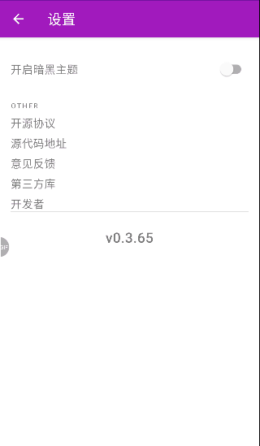

<h1 align="left">玩安卓</h1> 
    

    MVVM+Coroutine+koin实现的<a href="https://wanandroid.com/blog/show/2">玩安卓</a>
     MVVM(Databing/ViewModel/Navigation/room) 
<!-- vim-markdown-toc GFM -->

+ [ScreenShot](#screenshot)
+ [APK下载](#apk下载)
+ [特点](#特点)
+ [构建和使用](#构建和使用)
+ [其他：把最新版apk推送到gitee仓库，便于更新](#其他把最新版apk推送到gitee仓库便于更新)
+ [Todo](#todo)
+ [致谢](#致谢)

<!-- vim-markdown-toc -->
# ScreenShot

     
     

# APK下载
[WanAndroid](https://gitee.com/qinmen/WanAndroidServer)

# 特点
- 使用协程Coroutine
- 基于Navigation，1个Activity多个Fragment(except SplashActivity)
- [koin](https://github.com/InsertKoinIO/koin)实现依赖注入
- buildSrc + kotlin管理第三库依赖
- gradle + git 动态管理版本号和tag
- DrawerLayout + NavigationView + TabLayout
- Material Desing风格
- 暗黑主题
- room实现查询记录/浏览记录
- unit test with Room/koin

# 构建和使用
- 1. clone下载`git clone --recursive https://github.com/tainzhi/WanAndroid`
- 2. 需求：必须要Android Studio 4.0 以上
- 3. 构建打包`./gradlew assembleDebug`
- 4. 执行本地单元测试`./gradlew test`

# 其他：把最新版apk推送到gitee仓库，便于更新
推送到[gitee](https://gitee.com/qinmen/GithubServer/tree/master/WanAndroid), [action具体使用](./readme/github_action.md)
- 修改app/build.gradle下面的`def updateDescription = "1.update test 2.update test"`
- 添加升级信息后，打git tag后push，触发github action, assembleRelease
- 通过action签名apk后上传到release asset, 同时也上传到gitee，用作下载更新链接
- gitee下的`update.json`内容生成步骤为：assembleRelease生成了update.json和apk后，再通过gradle添加打包时间和对应的gitee下载链接后，通过git
  ssh上传到gitee，便于下载

# Todo
- [] 参考[android developer/testing](https://developer.android.com/training/testing)添加各种测试
- [] 升级youthbanner
- [] 升级[BaseRecyclerViewAdapterHelper](https://github.com/CymChad/BaseRecyclerViewAdapterHelper/releases)
- [] 历史记录分页查找`select * from table_name limit 10 offset 0`
- [] 参考[android developer/performance](https://developer.android.com/topic/performance)优化app
- [] 内存泄漏处理
- [] [github action](./.github/workflow/release_gitee.yml):
  不能自动执行；[README](./.github/workflow/README.md)中记录了git push tag后触发
- [] [bugly符号表上传](https://bugly.qq.com/docs/user-guide/symbol-configuration-android/?v=20200203205953):
  改gradle插件最新版3.0在Maven仓库中无法找到，只能使用2.1.0

# 致谢
学习了[Lulululbj Wanandroid](https://github.com/lulululbj/wanandroid/)大神很多，也像众多其他大佬学习了很多。感谢

